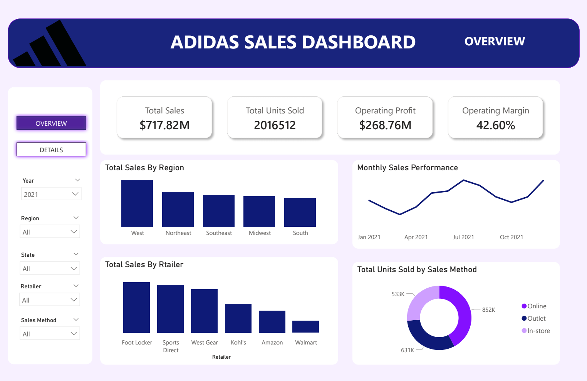
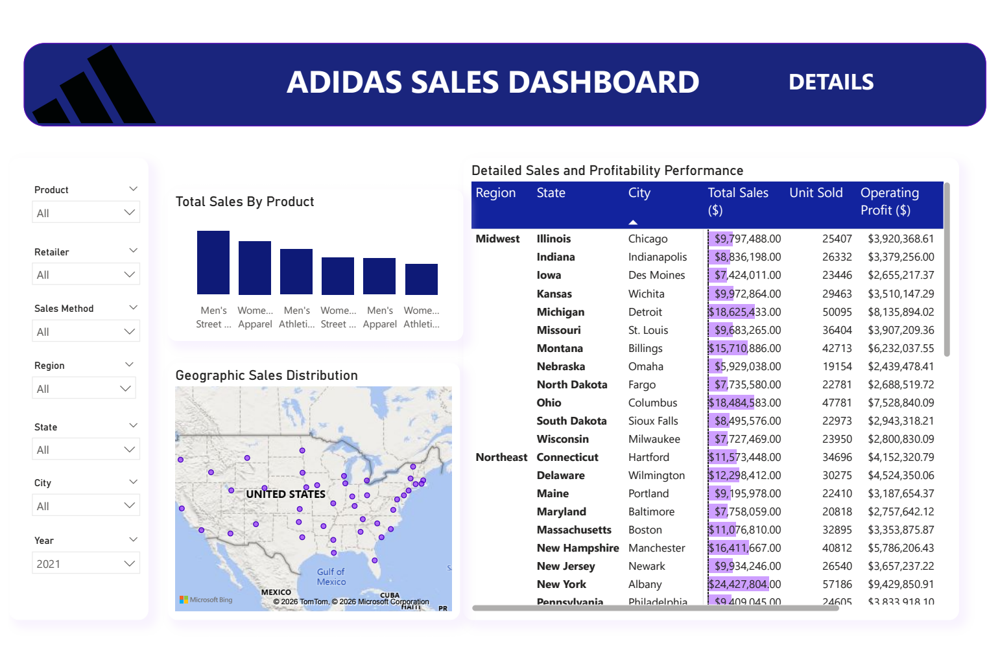

# Adidas Sales Dashboard (Power BI)

[-blue?style=for-the-badge)](https://www.kaggle.com/datasets/heemalichaudhari/adidas-sales-dataset)

Interactive sales performance dashboard built in Power BI, analyzing Adidas 2020-2021 US sales data. Demonstrates end-to-end data analytics workflow: data transformation, modeling, DAX measures, and insightful visualizations.

## Project Overview
This dashboard provides stakeholders with a clear view of Adidas sales performance across regions, retailers, products, and sales channels. It features:
- Interactive slicers for dynamic filtering (Product, Retailer, Sales Method, Region, State, City, Year)
- Two pages: **Overview** (high-level KPIs and trends) and **Details** (granular breakdowns and geographic view)
- Focus on business insights for revenue growth and profitability

Built using the public Adidas US Sales Dataset (Kaggle).

## Key Features
- **KPIs**: Total Sales, Units Sold, Operating Profit, Operating Margin
- **Visuals**:
  - Bar charts: Sales by Region, Retailer, and Product
  - Line chart: Monthly sales trends
  - Donut chart: Units sold by Sales Method (In-store vs Online vs Outlet)
  - Filled map: Geographic sales distribution across US cities
  - Detailed table: Sales and profit by region/state/city

## Key Business Insights
- West region dominates sales, followed by Northeast and Southeast
- Foot Locker is the top-performing retailer
- Total units sold online  exceeded both in-store and outlet sales.
- Men's Street Footwear and Women's Apparel are top product categories
- Strong operating margin of 42.60% overall

## Technologies & Skills Demonstrated
- Power BI Desktop (Data import, Power Query transformations, Data modeling)
- DAX for calculated measures (e.g., Total Sales, Operating Profit, Margin %)
- Visualization best practices (color scheme, layout, interactivity)

## Screenshots

### Overview Page

### Details Page

## How to Explore
1. Download and open `Adidas_Sales_Dashboard.pbix` in Power BI Desktop (free).
2. View static version: [adidass_sales_dashboard.pdf](adidass_sales_dashboard.pdf)
3. Dataset: `/data/adidas_sales_data.csv` 

## About
Part of my data analytics portfolio — complementing projects in Tableau, SQL, Python, and dbt.  
[View my GitHub profile](https://github.com/MoKoul) 
